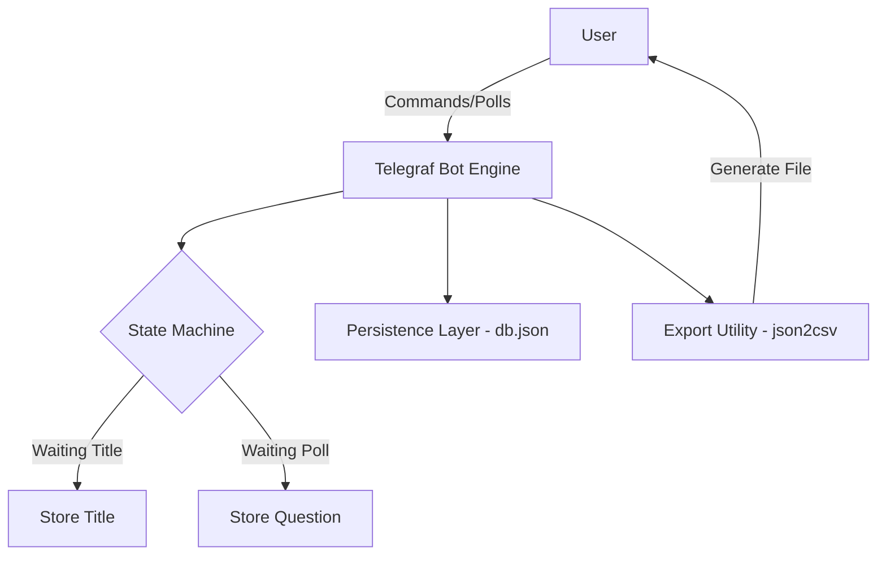

# QuizBot - Advanced Telegram Learning & Analytics

[](https://github.com/soltsega/Quizbot/blob/main/LICENSE)
[](https://telegraf.js.org/)

A professional, feature-rich Telegram Bot designed to replicate and extend the official `@QuizBot` capabilities. Built for educators, community managers, and teams who need **Data-Driven Insights** and **Collaborative Workflows**.

---

## Key Features

### 🔹 Core Quiz Creation
Replicates the seamless flow of the official bot.
- **Multistep Flow**: Title → Description → Questions (Polls).
- **Native Poll Support**: Send polls directly to the bot to build your quiz.
- **Persistent Storage**: All quizzes are saved securely in a local JSON database.

### Advanced Analytics
Go beyond simple scores with professional data exports.
- **CSV Export**: Download detailed attempt statistics for any quiz.
- **Performance Tracking**: Monitor user scores, timestamps, and usernames.

### Workbook System (NEW)
Group multiple quizzes into cohesive educational blocks.
- **Cumulative Leaderboards**: Aggregate scores across an entire workbook.
- **Consolidated Exports**: Download a bird's-eye view of all quizzes in a workbook.

### Seamless Collaboration
Work with your team on shared content.
- **Multi-user Access**: Assign "Collaborators" to your workbooks.
- **Shared Management**: Collaborators can add quizzes and view stats without owning the workbook.

---

## 🛠 Command Reference

| Command | Description |
| :--- | :--- |
| `/start` | Initial bot handshake |
| `/newquiz` | Start the quiz creation wizard |
| `/quizzes` | List all quizzes you own |
| `/exportstats <id>` | Get a CSV of quiz results |
| `/newworkbook <name>`| Initialize a new workbook |
| `/addtoworkbook <wId> <qId>` | Link a quiz to a workbook |
| `/shareworkbook <wId> <uId>` | Add a collaborator to a workbook |
| `/workbookleaderboard <wId>` | Show cumulative rankings |
| `/exportworkbook <wId>` | Export workbook summary to CSV |
| `/cancel` | Abort the current creation flow |

---

## Setup & Installation

### 1️⃣ Prerequisites
- **Node.js** (v16.x or higher)
- **NPM** (v8.x or higher)
- A **Bot Token** from [@BotFather](https://t.me/botfather)

### 2️⃣ Installation
```bash
git clone https://github.com/soltsega/Quizbot.git
cd Quizbot
npm install
```

### 3️⃣ Configuration
Create a `.env` file in the root directory:
```env
BOT_TOKEN=your_telegram_bot_token_here
```

### 4️⃣ Execution
```bash
npm start
```

---

## System Architecture



---

## 🛡 License
This project is licensed under the **ISC License**.

---
